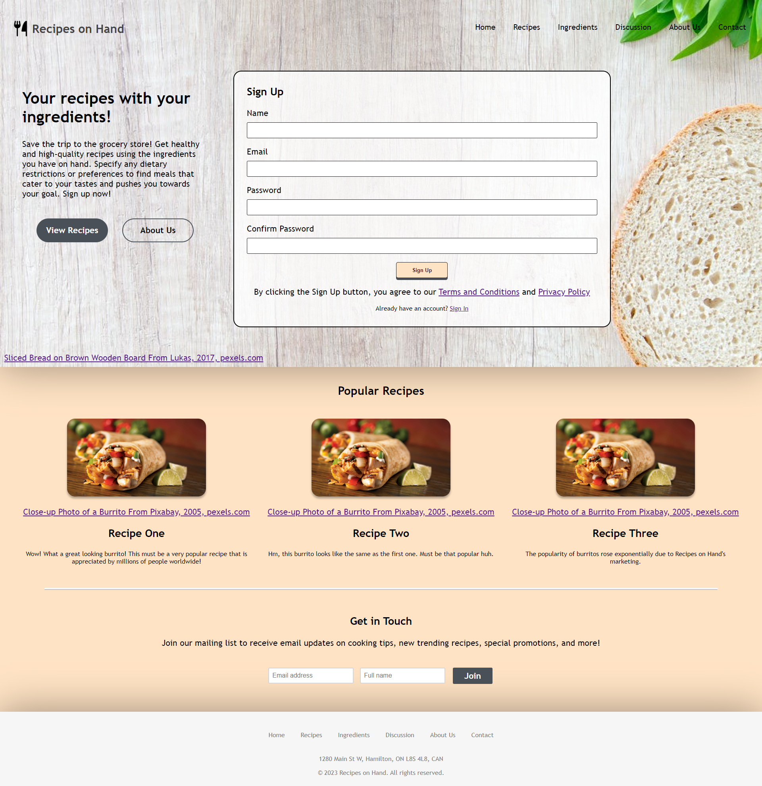

# Recipes on Hand
Recipes on Hand presents the user with healthy and high-quality recipes on demand using the ingredients they have on hand. This tool will save many trips to the grocery store, finally using the food that may spoil soon, and open a pathway to infinite culinary possibilities.

Built in HTML, CSS, and JavaScript, Recipes on Hand gives you access to over 2.3 million recipes through Edamam's Recipe Search API. 

Features:
- Register and Login functionality using regular expression validation and saving the user object into LocalStorage using JSON serialization.
- Community interactions through comments and posts that are linked to the current account and saved through LocalStorage.
- Recipe searches dynamically updates pages with display images, ingredients, and nutritional facts corresponding to search query.

